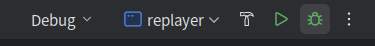

1.克隆下来的新项目，使用clion打开会显示需要加载下配置文件——**一般是项目同级最大的那个cmakelist,选择加载配置**

2.

上述Debug是代表cmake是debug模式，replayer是可执行文件的名字；

小锤子代表构建（生成build文件夹，生成makefile，make的过程）

    mkdir build
    cd build
    cmake ..  这个代表用上一级目录的cmakelist来产生makefile
    make -j8  make代表编译生成可执行文件（.o目标对象链接了库文件），-j8代表用几个cpu核来处理，越多编译越快