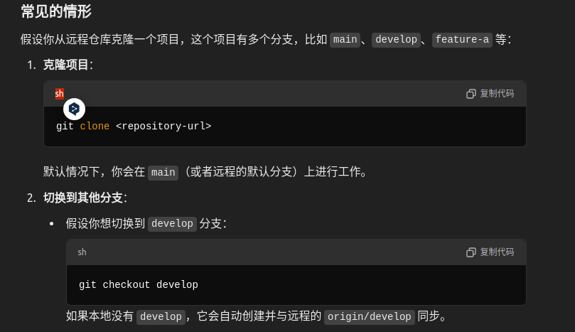

# 一、git的使用

## 1.1基本使用流程


1.一般写代码会有一个文件夹（**工作空间**）来存放所有的代码，我们在这一级目录选择git bash here 。

```
输入git init
```

会在这个工作空间产生一个代码本地代码仓库，默认分支master。**每次新开一个都会是默认master**

```
然后输入git branch -M main
```

输入上述代码指令可以**重命名当前分支**，这个是最新的，强制重新命名！！！！

```
git add .
```

输入上述代码会把当前工作空间的所有东西添加到缓存区.如果只要某个文件，输入如下代码

```
git add xxx
```

之后提交到本地仓库（这个工作空间创建的本地仓库）

```
git commit -m "这个地方随便写，可以写声明"
```

之后需要链接到云端的仓库，使用下面的代码（**此时上传是使用https协议，如果后续使用SSH协议添加了密钥和公钥，要删除这次的链接换下新的**）

**一个本地仓库可以连接多个云端仓库，但一般来说一个本地仓库会和一个云端仓库相对应。**

```
git remote add XXX 输入github仓库地址https的   XXX是仓库名任意取
```

检查该本地仓库链接的所有云端仓库：

```
git remote -v   -v会显示所有远端仓库的名称以及上传下拉的地址
```

最后是上传到云端的仓库

```
git push -u origin master
```

**-u是连接到这个仓库的分支**，以后用 git push就行默认。**-f是强制上传覆盖**。**origin和master名字可以更换**

一般来说一个本地仓库会和一个云端仓库相对应。

如果出现远程代码仓库更新了，我这边也有更新的要上传，我们需要先更新我们本地仓库：

```
git pull origin master
```

​	**`git fetch` 命令用于从远程仓库下载所有分支的最新提交和更新，但不会自动合并这些更新到你当前的工作分支。如果你希望将这些更新合并到你的当前分支，可以手动执行 `git merge origin/main`。**

​	`git pull` 是 `git fetch` 和 `git merge` 的组合操作。它不仅会从远程仓库获取最新的更新，还会立即将这些更新合并到当前分支。

**删除本地代码仓库，在对应的工作空间目录删除.git文件夹，然后在这一级目录打开bash运行：**

```
rm -rf .git
```


## 1.2SSH密钥

​	添加 SSH 密钥的目的是为了在使用 **Git（或其他工具）**与**远程服务器（如 GitHub、GitLab、Bitbucket 等）**进行通信时，实现安全、**无密码**的身份验证。


​			路径和私钥密码我全部回车了

​                 ****

​	SSH密钥分为公钥和私钥，**私钥存放于自己的电脑上（用于加密上传数据），公钥放在云端对应的密钥地方（用于解密上传数据）**

​	github来说：**User一定是git,Host是github.com**，从仓库git clone的SSH可以看出来

## 1.3 git上传的情况

​	有时候有这样的情况：**github上面云端有了新文件提交修改，本地也有新的文件想上传。**这时候需要如下步骤：

```
git fetch orangepi main #下载云端最新提交和更新
git log Head..orangepi/main
git diff Head..orangepi/main   #查看差异，head是本地，orangepi main是云端
手动检查修改好差异。
因为我们还有要上传的文件
git stash
git merge OrangePi/main
git stash pop

之后再git add xxx
git commit -m ""
最后再提交
```

**git status是查看工作空间和缓存区的变化**

## 重点：git pull作用工作区


## 1.4 HTTPS协议换成SSH协议


重点：**SSH协议比HTTPS协议更安全稳定，不用输入密码，传输东西更多！！！**

**有时候用HTTPS协议访问会网不行懂的你！！！**

## 1.5 git配置文件地址

### 1.用户名和邮箱

C:\Users\14586下的.gitconfig文件中，制定了使用git的全局姓名和邮箱

### 2.SSH密钥配置

C:\Users\14586\.ssh下的id_rsa是私钥，id_rsa.pub是公钥。

config文件中会指明公钥私钥用于哪个开源网站

## 1.6 VS Code上传github代码

1.点击源代码管理：

​	此处会显示项目的工作空间，有几个显示几个。如果在某个工作空间的源代码更改了，会显示在下面。

我的情况是已经使用git bash创建了本地仓库，与github对应仓库都连接好了。建议初始化用命令行：git init等等。

之后可以在code来方面上传。（我的两个工作空间都是SSH协议了很方面，不受网络影响，不输入密码）


M代表又修改了，↩︎剪头不能点，**会删除本地的这个文件都**，入股有没追踪的放在那里就好。点击➕暂存更改（**就是提交到缓存区**）


在红线地方输入commit声明。


最后点击同步更改即可。

​	**总结：code使用图形化提交方便，不用输入代码。建议创建仓库和链接github先用代码，后续更改使用code，这样也防止忘记代码，也提高效率。**

## 1.7VS Code下拉github代码

​	因为我的本地仓库没有设置默认的上游分支，**不可以直接拉取，要拉取自**


## 1.8总结重点

精华：**先拉再推**

## 1.9 补充.gitignore

vs code中可以添加到.gitignore，相当于是忽略XXX文件或文件夹的管理，也要把其自身.gitignore添加进去，**如果需要删除XXX忽略，可以从.gitinore中删除指定的就行。**

如果需要重启.gitignore可以**Ctrl+Shift+P来输入他的名字就出来了！！！**

## 2.0 idea中的git

重点：**Ctrl+F快速搜索**


这个地方点击打开git管理窗口，可以实时显示信息


git的推送那些在上面点击对应的git选项


第一个是提交：显示修改了的文件

第二个是拉取：可以关联github

## 2.1 远端无项目这样做（远端本地都刚新建仓库）
1.本地创建一个文件夹，初始化git代码仓

2.git remote add origin URL地址,连接到远程仓库

3.本地开发好后，git add .

4.git commit

5.git push


## 2.2 远端有项目的情况，拉下来开发再推送
1.在本地建立好要存储项目的文件夹

2.拉取远端的项目：

    2.1 直接拉取整个代码仓库
    git clone + SHH/http的url
    2.2 拉取某个分支的
    git clone -b 分支名称 +url路径
总结：
当你使用 git clone 从远程仓库克隆整个项目时，Git 会自动为你完成初始化步骤，也就是说，克隆下来的仓库已经是一个完整的 Git 仓库，它已经具备以下内容：

    1.Git 仓库初始化（git init）：Git 在克隆时会自动完成初始化，你不需要手动执行 git init。
    2.关联远程仓库：Git 会自动关联到远程仓库（通常是 GitLab、GitHub 等的地址）。你可以使用 git remote -v 查看已经配置好的远程仓库信息。
    重点：通常在克隆时默认叫 origin
3.如果是拉取的整个项目，到时候切换对应的分支工作即可。完事后执行：
    
    git add .
    git commit -m "Made changes to feature-branch"
    git push origin feature-branch
    此时，Git 只会把你在 feature-branch 分支上的更改推送到远程的 feature-branch，并不会推送其他分支上的内容或整个仓库的所有分支。

4.切换分支的命令区别

    git checkout feature-branch 切换到已存在的分支
    git checkout -b new-feature 创建并切换到一个新的分支
    重点：
    无论你在 main 上创建 feature-x，还是在其他分支上创建新分支，这个新分支总是会继承你当前所在分支的所有内容，包括所有的文件和提交历史。

5.基于现在的创建了一个新分支，仓库默认是关联的，缓存提交，直接推送就好

    git push -u origin feature-x
    执行了 git push -u origin feature-x 之后，远程仓库中就会出现一个名为 feature-x 的新分支。




同理如果是拉取某个分支，就是自动创建相应的分支名称


