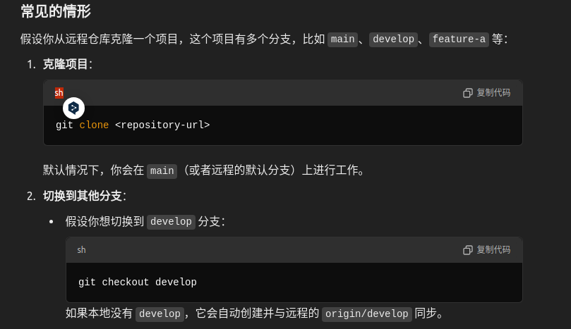

# 一、git的使用

## 1.1基本使用流程


1.一般写代码会有一个文件夹（**工作空间**）来存放所有的代码，我们在这一级目录选择git bash here 。

```
输入git init
```

会在这个工作空间产生一个代码本地代码仓库，默认分支master。**每次新开一个都会是默认master**

```
然后输入git branch -M main
```

输入上述代码指令可以**重命名当前分支**，这个是最新的，强制重新命名！！！！

```
git add .
```

输入上述代码会把当前工作空间的所有东西添加到缓存区.如果只要某个文件，输入如下代码

```
git add xxx
```

之后提交到本地仓库（这个工作空间创建的本地仓库）

```
git commit -m "这个地方随便写，可以写声明"
```

之后需要链接到云端的仓库，使用下面的代码（**此时上传是使用https协议，如果后续使用SSH协议添加了密钥和公钥，要删除这次的链接换下新的**）

**一个本地仓库可以连接多个云端仓库，但一般来说一个本地仓库会和一个云端仓库相对应。**

```
git remote add XXX 输入github仓库地址https的   XXX是仓库名任意取
```

检查该本地仓库链接的所有云端仓库：

```
git remote -v   -v会显示所有远端仓库的名称以及上传下拉的地址
```

最后是上传到云端的仓库

```
git push -u origin master
```

**-u是连接到这个仓库的分支**，以后用 git push就行默认。**-f是强制上传覆盖**。**

**origin是之前XXX对应的上游仓库名称，master这个是要推送的本地分支名称，可以先改名为main好些！！！！**

一般来说一个本地仓库会和一个云端仓库相对应。

如果出现远程代码仓库更新了，我这边也有更新的要上传，我们需要先更新我们本地仓库：

```
git pull origin master
```

​	**`git fetch` 命令用于从远程仓库下载所有分支的最新提交和更新，但不会自动合并这些更新到你当前的工作分支。如果你希望将这些更新合并到你的当前分支，可以手动执行 `git merge origin/main`。**

​	`git pull` 是 `git fetch` 和 `git merge` 的组合操作。它不仅会从远程仓库获取最新的更新，还会立即将这些更新合并到当前分支。

**删除本地代码仓库，在对应的工作空间目录删除.git文件夹，然后在这一级目录打开bash运行：**

```
rm -rf .git
```


## 1.2SSH密钥

​	添加 SSH 密钥的目的是为了在使用 **Git（或其他工具）**与**远程服务器（如 GitHub、GitLab、Bitbucket 等）**进行通信时，实现安全、**无密码**的身份验证。


​			路径和私钥密码我全部回车了

​                 ****

​	SSH密钥分为公钥和私钥，**私钥存放于自己的电脑上（用于加密上传数据），公钥放在云端对应的密钥地方（用于解密上传数据）**

​	github来说：**User一定是git,Host是github.com**，从仓库git clone的SSH可以看出来

## 1.3 git上传的情况

​	有时候有这样的情况：**github上面云端有了新文件提交修改，本地也有新的文件想上传。**这时候需要如下步骤：

```
git fetch orangepi main #下载云端最新提交和更新
git log Head..orangepi/main
git diff Head..orangepi/main   #查看差异，head是本地，orangepi main是云端
手动检查修改好差异。
因为我们还有要上传的文件
git stash
git merge OrangePi/main
git stash pop

之后再git add xxx
git commit -m ""
最后再提交
```

**git status是查看工作空间和缓存区的变化**

## 重点：git pull作用工作区


## 1.4 HTTPS协议换成SSH协议


重点：**SSH协议比HTTPS协议更安全稳定，不用输入密码，传输东西更多！！！**

**有时候用HTTPS协议访问会网不行懂的你！！！**

## 1.5 git配置文件地址

### 1.用户名和邮箱

C:\Users\14586下的.gitconfig文件中，制定了使用git的全局姓名和邮箱

### 2.SSH密钥配置

C:\Users\14586\.ssh下的id_rsa是私钥，id_rsa.pub是公钥。

config文件中会指明公钥私钥用于哪个开源网站

## 1.6 VS Code上传github代码

1.点击源代码管理：

​	此处会显示项目的工作空间，有几个显示几个。如果在某个工作空间的源代码更改了，会显示在下面。

我的情况是已经使用git bash创建了本地仓库，与github对应仓库都连接好了。建议初始化用命令行：git init等等。

之后可以在code来方面上传。（我的两个工作空间都是SSH协议了很方面，不受网络影响，不输入密码）


M代表又修改了，↩︎剪头不能点，**会删除本地的这个文件都**，入股有没追踪的放在那里就好。点击➕暂存更改（**就是提交到缓存区**）


在红线地方输入commit声明。


最后点击同步更改即可。

​	**总结：code使用图形化提交方便，不用输入代码。建议创建仓库和链接github先用代码，后续更改使用code，这样也防止忘记代码，也提高效率。**

## 1.7VS Code下拉github代码

​	因为我的本地仓库没有设置默认的上游分支，**不可以直接拉取，要拉取自**


## 1.8总结重点

精华：**先拉再推**

## 1.9 补充.gitignore

vs code中可以添加到.gitignore，相当于是忽略XXX文件或文件夹的管理，也要把其自身.gitignore添加进去，**如果需要删除XXX忽略，可以从.gitinore中删除指定的就行。**

如果需要重启.gitignore可以**Ctrl+Shift+P来输入他的名字就出来了！！！**

## 2.0 idea中的git

重点：**Ctrl+F快速搜索**


这个地方点击打开git管理窗口，可以实时显示信息


git的推送那些在上面点击对应的git选项


第一个是提交：显示修改了的文件

第二个是拉取：可以关联github

## 2.1 远端无项目这样做（远端本地都刚新建仓库）
1.本地创建一个文件夹，初始化git代码仓

2.git remote add origin URL地址,连接到远程仓库

3.本地开发好后，git add .

4.git commit

5.git push


## 2.2 远端有项目的情况，拉下来开发再推送
1.在本地建立好要存储项目的文件夹

2.拉取远端的项目：

    2.1 直接拉取整个代码仓库
    git clone + SHH/http的url
    2.2 拉取某个分支的
    git clone -b 分支名称 +url路径
总结：
当你使用 git clone 从远程仓库克隆整个项目时，Git 会自动为你完成初始化步骤，也就是说，克隆下来的仓库已经是一个完整的 Git 仓库，它已经具备以下内容：

    1.Git 仓库初始化（git init）：Git 在克隆时会自动完成初始化，你不需要手动执行 git init。
    2.关联远程仓库：Git 会自动关联到远程仓库（通常是 GitLab、GitHub 等的地址）。你可以使用 git remote -v 查看已经配置好的远程仓库信息。
    重点：通常在克隆时默认叫 origin
3.如果是拉取的整个项目，到时候切换对应的分支工作即可。完事后执行：
    
    git add .
    git commit -m "Made changes to feature-branch"
    git push origin feature-branch
    此时，Git 只会把你在 feature-branch 分支上的更改推送到远程的 feature-branch，并不会推送其他分支上的内容或整个仓库的所有分支。

4.切换分支的命令区别

    git checkout feature-branch 切换到已存在的分支
    git checkout -b new-feature 创建并切换到一个新的分支
    重点：
    无论你在 main 上创建 feature-x，还是在其他分支上创建新分支，这个新分支总是会继承你当前所在分支的所有内容，包括所有的文件和提交历史。

5.基于现在的创建了一个新分支，仓库默认是关联的，缓存提交，直接推送就好

    git push -u origin feature-x
    执行了 git push -u origin feature-x 之后，远程仓库中就会出现一个名为 feature-x 的新分支。




同理如果是拉取某个分支，就是自动创建相应的分支名称

# 二、git和git lfs的区别及使用

## 2.1 概述

**Git** 和 **Git LFS** 不是替代关系，而是互补关系：

- **Git**: 专为**代码和文本文件**优化的版本控制系统
- **Git LFS**: Git 的扩展，专门处理大文件**（数据集和模型文件）**的存储和版本管理

## 2.2 核心区别对比

| 特性         | Git                       | Git LFS                           |
| :----------- | :------------------------ | :-------------------------------- |
| **设计目的** | 代码版本控制              | 大文件版本管理                    |
| **文件存储** | **直接存储在 `.git`目录** | **存储指针，实际文件在LFS服务器** |
| **仓库体积** | 随文件数量线性增长        | 基本恒定（只存储指针）            |
| **克隆性能** | 下载所有历史版本          | **可选择只下载当前版本**          |
| **网络效率** | 每次传输完整文件          | 智能差异传输                      |
| **适用场景** | 代码、配置文件、文档      | 模型、数据集、媒体文件            |

## 2.3 初始化设置区别

### 2.3.1 Git 设置

```
# 无需特殊设置
git init
git clone <repository>
```

### 2.3.2 Git LFS 设置（mac推荐brew下载，然后install一次就行）

```
# 需要安装和配置
git lfs install

# 指定跟踪的文件类型
git lfs track "*.pth"
git lfs track "*.zip"
git lfs track "models/"

# 必须提交配置文件
git add .gitattributes
```

## 2.4 日常使用工作流

### 2.4.1 添加和提交文件

#### 普通文件（两者相同）

```
git add README.md script.py config.yaml
git commit -m "添加代码文件"
```

#### 大文件处理区别

**Git LFS（推荐）**

```
# LFS 自动识别和处理大文件
git add large_model.pth dataset.zip

git commit -m "添加模型和数据集"
# 输出: LFS: 2 files, 600.00MB

git push  # 大文件上传到LFS服务器
```

**普通 Git（不推荐）**

```
git add large_model.pth dataset.zip
git commit -m "添加文件"  # 提交缓慢
git push  # 推送缓慢，仓库膨胀
```

### 2.4.2 仓库克隆操作

#### Git LFS 克隆选项

```
# 1. 自动下载LFS文件（默认）
git clone https://huggingface.co/datasets/example

# 2. 仅克隆指针，按需下载
GIT_LFS_SKIP_SMUDGE=1 git clone https://huggingface.co/datasets/example
cd example
git lfs pull  # 需要时下载大文件

# 3. 下载特定LFS文件
git lfs pull --include="models/important.pth"
```

#### 普通 Git 克隆

```
git clone https://github.com/example/repo
# 所有文件立即下载，无法选择性下载
```

## 2.5 文件管理命令对比

### 2.5.1 查看文件状态

**Git LFS**

```
git lfs ls-files          # 查看LFS跟踪的文件
git lfs status            # 查看LFS文件状态
git lfs track             # 查看当前跟踪模式
git lfs env               # 查看LFS环境信息
```

**普通 Git**

```
git ls-files              # 查看所有跟踪文件
git status                # 标准状态检查
git log --oneline --graph # 查看提交历史
```

### 2.5.2 文件大小检查

```
# LFS文件初始显示指针大小
ls -lh large_model.pth    # 显示: 130B (指针文件)

# 下载实际文件后
git lfs pull
ls -lh large_model.pth    # 显示: 100M (实际文件)
```

## 2.6 Hugging Face 特别说明

对于 Hugging Face 数据集和模型仓库：

1. **强烈推荐使用 Git LFS** - 平台为LFS文件提供优化存储
2. **自动LFS支持** - 克隆时自动处理LFS文件下载
3. **存储配额** - 注意平台的LFS存储限制
4. **下载优化** - 利用HF的CDN加速大文件下载

```
# Hugging Face 最佳实践
git lfs install
git lfs track "*.pth" "*.safetensors" "data/*.parquet"
git add .gitattributes
git add .
git commit -m "添加模型和数据集"
git push
```

## 2.7 疑问解答

意思就是我git lfs下载安装好后，平时没有大文件正常git使用就行。有大文件就git lfs track "xxx"这样，然后多一步git add .gitattributes这个，其他的还是正常git？.gitattributes是自动生成的吗？

理解完全正确

### 2.7.1 工作流程总结：

1. **安装 Git LFS**（一次性操作）
2. **日常使用**：和以前一样正常使用 `git add/commit/push`
3. **遇到大文件时**：多一步 `git lfs track "文件模式"`
4. **提交时**：记得包含 `.gitattributes`文件
5. **其他操作**：完全和普通 Git 一样

------

## 2.7.2 关于 `.gitattributes`文件

### 它是**自动生成+手动维护**的：

**自动生成部分**：

```
# 当你运行 track 命令时，LFS 会自动修改 .gitattributes
git lfs track "*.pth"
# 自动在 .gitattributes 中添加：*.pth filter=lfs diff=lfs merge=lfs -text
```

**文件内容示例**：

```
# 这是自动生成和手动维护的配置文件
*.pth filter=lfs diff=lfs merge=lfs -text
*.zip filter=lfs diff=lfs merge=lfs -text
models/ filter=lfs diff=lfs merge=lfs -text
data/**.parquet filter=lfs diff=lfs merge=lfs -text

# 你可以手动添加注释和调整
# 模型文件使用 LFS
*.pth filter=lfs diff=lfs merge=lfs -text
*.pt filter=lfs diff=lfs merge=lfs -text

# 数据集文件使用 LFS  
*.zip filter=lfs diff=lfs merge=lfs -text
```

------

## 2.7.3 完整的使用示例

### 场景：机器学习项目，第一次添加模型文件

```
# 1. 初始化LFS（只需一次）
git lfs install

# 2. 告诉LFS要跟踪.pth文件
git lfs track "*.pth"

# 3. 查看自动生成的.gitattributes
cat .gitattributes
# 输出：*.pth filter=lfs diff=lfs merge=lfs -text

# 4. 正常git操作，但记得添加.gitattributes
git add .gitattributes    # ⭐ 重要：添加LFS配置
git add model.pth         # 大文件（自动用LFS处理）
git add train.py          # 小文件（正常Git处理）

# 5. 提交和推送（完全正常操作）
git commit -m "添加训练脚本和模型"
git push
```

### 后续日常使用：

```
# 修改代码文件（完全正常使用）
git add train.py
git commit -m "优化训练逻辑"
git push

# 添加新的大文件（需要先track）
git lfs track "*.h5"
git add .gitattributes    # 更新LFS配置
git add new_model.h5
git commit -m "添加新模型格式"
git push
```

------

## 2.7.4 重要提醒

### ✅ **必须操作**：

```
# 添加新文件类型后，一定要提交.gitattributes
git add .gitattributes
```

### ❌ **常见错误**：

```
# 错误：只添加了大文件，忘了.gitattributes
git lfs track "*.pth"
git add model.pth
git commit -m "add model"  # ❌ 缺少.gitattributes

# 正确：同时添加配置和文件
git lfs track "*.pth"
git add .gitattributes model.pth
git commit -m "add model"  # ✅ 正确
```

------

## 2.7.5 验证LFS是否正常工作

```
# 检查哪些文件被LFS跟踪
git lfs ls-files

# 查看.gitattributes内容
cat .gitattributes

# 检查文件存储方式
git check-attr -a model.pth
```

## 2.7.6 总结

**你的理解完全正确**：

- ✅ 平时小文件：正常使用 Git，完全不用想 LFS
- ✅ 遇到大文件：`git lfs track "模式"`+ `git add .gitattributes`
- ✅ 其他操作：和普通 Git 完全一样
- ✅ `.gitattributes`：LFS 自动生成和维护，你只需要记得提交它


# 三、从零开始上传项目到 GitHub 完整流程（含 .gitignore + Git LFS）

适用场景：本地项目开发完成，需要上传到 GitHub，项目中有不需要 Git 管理的文件（如 `.claude`、`.vscode`），也有超过 100MB 的大文件（如模型权重 `.pth`）。

## 3.1 第一步：初始化本地仓库

```
cd /你的项目目录
git init
git branch -M main
```

## 3.2 第二步：配置 .gitignore（排除不需要的文件）

在项目根目录创建 `.gitignore` 文件，写入不需要 Git 管理的文件和文件夹：

```
# IDE 和编辑器配置
.vscode/
.idea/

# AI 工具配置
.claude/

# Python 相关
__pycache__/
*.pyc
.env
venv/

# 系统文件
.DS_Store
Thumbs.db

# 其他不需要上传的
*.log
```

**重点：`.gitignore` 必须在 `git add` 之前创建好，否则已经被 Git 追踪的文件不会被忽略。**

## 3.3 第三步：配置 Git LFS（处理大文件）

如果项目中有大文件（超过 100MB），必须在 `git add` 之前配置好 LFS：

```
# 1. 初始化 LFS（每台电脑只需一次）
git lfs install

# 2. 指定哪些文件用 LFS 管理
git lfs track "*.pth"          # 按后缀追踪
git lfs track "*.pt"
git lfs track "*.onnx"
git lfs track "*.zip"
# 也可以指定具体路径
git lfs track "weights/*.pth"

# 3. 确认 .gitattributes 已自动生成
cat .gitattributes
```

## 3.4 第四步：添加文件到暂存区并提交

```
# 先添加 .gitignore 和 .gitattributes
git add .gitignore .gitattributes

# 再添加所有文件（被 .gitignore 排除的不会被添加，大文件自动走 LFS）
git add .

# 提交到本地仓库
git commit -m "初始提交"
```

## 3.5 第五步：关联远程仓库并推送

```
# 在 GitHub 上新建一个空仓库（不要勾选 README、.gitignore 等初始化选项）

# 关联远程仓库（推荐 SSH 协议）
git remote add origin git@github.com:用户名/仓库名.git

# 推送
git push -u origin main
```

## 3.6 常见问题处理

### 问题一：大文件已经 commit 了才发现超过 100MB，push 被拒绝

这就是本次遇到的情况，解决步骤：

```
# 1. 安装并初始化 LFS
git lfs install

# 2. 用 migrate 重写历史，把大文件转为 LFS 指针
git lfs migrate import --include="路径/大文件1,路径/大文件2" --everything

# 例如：
git lfs migrate import --include="det-system/pths/aclnetpth/aclnet.pth,det-system/pths/epsnetpth/epsnet.pth" --everything

# 3. 验证 LFS 是否追踪成功
git lfs ls-files

# 4. 因为历史被重写了，需要 force push
git push -u origin main --force
```

**重点：`git lfs migrate import` 会重写本地 Git 历史，只影响本地，不会自动推送。必须手动 `--force` 推送。**

### 问题二：.gitignore 创建晚了，文件已经被追踪了

```
# 从 Git 追踪中移除（不删除本地文件）
git rm -r --cached .vscode/
git rm -r --cached .claude/

# 然后提交
git add .gitignore
git commit -m "添加 .gitignore，移除不需要追踪的文件"
git push
```

## 3.7 完整命令速查（从零开始一条龙）

```
# ===== 1. 初始化 =====
cd /你的项目目录
git init
git branch -M main

# ===== 2. 创建 .gitignore =====
# 在项目根目录创建 .gitignore，写入要排除的文件

# ===== 3. 配置 LFS（有大文件时） =====
git lfs install
git lfs track "*.pth"
# 根据需要 track 其他大文件类型

# ===== 4. 添加并提交 =====
git add .gitignore .gitattributes
git add .
git commit -m "初始提交"

# ===== 5. 关联远程仓库并推送 =====
git remote add origin git@github.com:用户名/仓库名.git
git push -u origin main

# ===== 后续日常使用 =====
git add .
git commit -m "描述修改内容"
git push
```

**核心原则：先 .gitignore → 再 LFS track → 最后 git add，顺序不能乱！**

