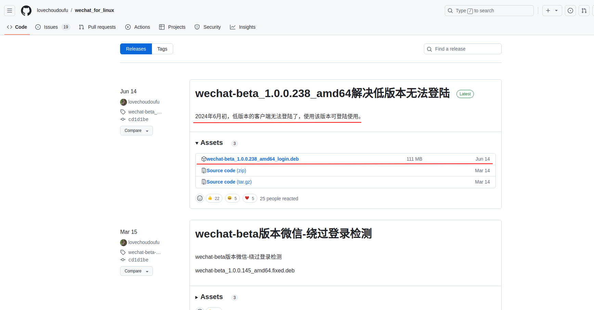

# 记录ubuntu下微信的安装步骤
## 一、来源
    现在市面上安装方式基本上就是：wine(wine不是模拟器)、ukylin-wine、dooplin-wine、Electron-ui、优麒麟官网推出的微信直接下载deb包。
之前最开始，我是用的最后一种，但会出现bug，有时候退出来，再也打不开！！！其余的wine安装方式：都是下载wine或者其他公司开发的类似wine环境，通过这个环境安装windows中的微信，有些安装太麻烦配置，有些安装完成显示版本过低，进不去等等。

## 二、最终选取了github上大佬发出来的deb包，这个选择的是最新的deta版本。

    仓库地址：https://github.com/lovechoudoufu/wechat_for_linux/releases

    安装方式（dkpg）:sudo dpkg -i wechat-beta_1.0.0.238_amd64_login.deb
